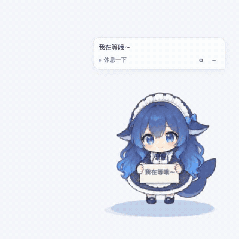
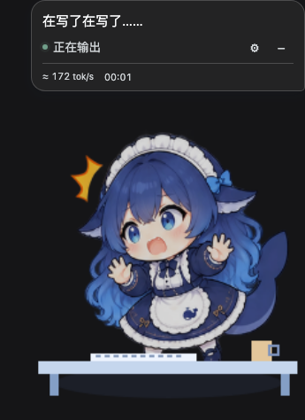

<div align="center">

# 🐋 大肥鱼 · DSH Bigfish

**让等待 Agent 工作的时间，多一只陪着你的大肥鱼。**

她会敲键盘、翻书、修工具、举牌等你，也会在任务结束时开心收工。<br>
一个装在 **DeepSeek Harness Web** 里的可拖动宠物，支持替换角色、制作动作和自定义台词。

[下载安装](https://github.com/gosomea/dsh-bigfish/releases/tag/v0.5.0) · [观看录屏](docs/media/bigfish-demo.mp4) · [制作自己的角色](#做一只属于你的宠物)



**默认安静陪伴 · 鞭策随时关闭 · 角色包自由替换**

</div>

> 上面的 GIF 和下面的录屏来自插件自带预览：使用实际宠物渲染与动画，任务和速度由演示数据驱动。只录制宠物区域，不包含聊天内容。社区独立项目，非 DeepSeek 官方产品。

## 她会做什么？

| 当你…… | 大肥鱼会…… |
| --- | --- |
| 还没开始工作 | 举牌打个招呼，然后安静陪着；也可以设置为偶尔互动 |
| 提交任务、等待首段输出 | 立即切换到工作准备状态，不再举着“我在等哦” |
| 看着模型输出 | 敲键盘、思考，跟随当前模型的相对速度调整节奏 |
| 让 Agent 读文件、搜索、执行工具 | 切换相应动作，在气泡里显示工具状态和可自定义的台词 |
| 需要确认或补充输入 | 停下来等你，不再催促输出 |
| 完成、取消或遇到错误 | 给出不同反馈；完成演出后回到休息 |

**不喜欢鞭策？关掉就好。** 齿轮里取消「启用鞭策动作」，鞭子及配套躲闪会一起关闭，正常工作动画继续。开启时只做非接触空挥，不会打到角色；默认静音。

## 先看看她

下面是宠物区域的使用截图，气泡、状态和控制按钮都是实际插件界面。

<table>
<tr>
<td align="center"><br><b>我在等哦</b><br>首次问候后安静陪伴</td>
<td align="center"><br><b>认真开工</b><br>气泡、速度和状态放在一起</td>
</tr>
<tr>
<td align="center"><br><b>工具也有动作</b><br>执行期间暂停空挥</td>
<td align="center"><br><b>夜里也陪着你</b><br>跟随明暗主题，鞭策可以关闭</td>
</tr>
</table>

**[▶ 观看 / 下载完整 MP4 录屏](docs/media/bigfish-demo.mp4)**：举牌 → 工作 → 速度变化 → 调用工具 → 等待确认 → 完成 → 关闭鞭策 → 深色模式。无需声音也能看懂。

### 不止是一张会晃的贴纸

内置大肥鱼有 **29 类动作、72 个绘制姿态、6 个场景、5 种举牌演出**。阅读、工具操作、打字、等待确认等使用连续图像帧；部分动作结合程序位移与场景道具。72 个姿态不等于 72 套独立动画。

最近精修了喝茶、擦汗和伸懒腰，让动作有准备、过程和收尾：


动作可以在「完整设置 → 角色库」逐个预览，内置大肥鱼也支持。

## 安装，开始陪伴

需要已经安装 **DeepSeek Harness（DSH）**，并使用它的 Web 界面。当前是 **0.5.0 体验版**；完整原生安装已验证 DSH `0.1.5-rc.1` / `0.1.5-rc.2`。Node 要求 `^22.19.0 || >=24.0.0`。

1. 从 [v0.5.0 Releases](https://github.com/gosomea/dsh-bigfish/releases/tag/v0.5.0) 下载 `dsh-bigfish-0.5.0.tgz`。
2. 安装到你实际使用的 Web profile：

```sh
dsh plugin --profile web add /absolute/path/to/dsh-bigfish-0.5.0.tgz
dsh --profile web
```

3. 打开或刷新 dsh-web，右下角就能找到她。`web` 请换成你的实际 profile 名称。

插件管理器自动注册配置，无需手工再加一份 `bigfish` patch。若 DSH 已在运行且仍加载旧模块，在任务空闲时重启，再刷新页面。

想先看效果？下载同一 Release 的 **`preview.html`**，用浏览器打开即可。它是单文件离线预览，可以切换速度、任务状态、场景及全部内置动作，**无需模型 API，也不会消耗 token**。这里的“离线”指预览；实际 Agent 工作仍由 DSH 及其模型配置决定。

[详细安装、升级与卸载](docs/installation.md) · [常见问题](docs/faq.md)

## 按你的习惯陪伴

- **想安静一点**：默认「安静陪着」，首次问候后不反复举牌、换台词。空闲互动、动作表现和说话频率分别控制。
- **想热闹一点**：开启偶尔互动或更活泼的动作。完整设置里可直接预览行为，先看再选。
- **不喜欢鞭策**：关闭「启用鞭策动作」。设置会保存，刷新或换角色后继续生效。
- **挡住内容了**：拖动宠物或气泡换位置；点 `−` 收起为图标，图标同样可以拖动。支持调整大小和透明度。
- **想换句台词**：在「自定义台词与工具」编辑工作、等待、完成等台词，给工具名称或前缀配置专属规则。
- **想换设备**：「完整设置 → 备份与恢复」导出角色、偏好、台词和编排。导入时先检查并预览，再确认恢复。

**不同模型，不用同一把尺子。** 自动模式按 provider、model、推理配置和统计通道分别学习速度，适配约 20～400 tok/s 等不同量级。显示的 `≈ tok/s` 是估算值；工具等待、首段等待不会简单算成“输出太慢”。可选择“慢了催一催”或“跟着输出节奏动”，也可手动设定目标。

**多个会话同时工作时，跟随你当前打开的会话。** 不叠加后台速度，后台完成不会抢走前台状态；当前会话空闲时，宠物也保持空闲。刷新历史记录不会重播庆祝。

[陪伴与设置说明](docs/settings-v2.md) · [台词与工具扩展](docs/dialogue.md) · [备份与恢复](docs/backup-and-storage.md)

## 做一只属于你的宠物

Bigfish 支持可替换的 **`.dshpet` 角色包**。角色包可以有比内置大肥鱼更多的动作，自定义动作 ID、标签、连续帧、台词和道具，不需要修改插件代码。

1. 在「完整设置 → 角色库」导入 `.dshpet` 或兼容 ZIP。
2. 先预览角色和每个动作，再安装并使用。
3. 切换角色时保留你的陪伴偏好；已安装版本可保留并切换。

Release 另附 **大肥鱼 · 成年版**：沿用原始鲸鱼女仆形象，保留尾巴与围裙标志，包含 8 组动作。

### 用一个 Skill 和 Agent 一起做角色

下载 Release 中的 `dsh-bigfish-pet-maker-1.0.2.zip`，将其中的 `dsh-bigfish-pet-maker` 文件夹放到 DSH 的 `~/.dsh/skills/`，或你的 Agent 支持的技能目录。

然后直接和 Agent 说：

> 用 $dsh-bigfish-pet-maker 做一只蓝色小狐狸。平时安静，工作时认真。设计打字、读书、搜索、执行工具、等确认、举牌和完成庆祝，再加一些狐狸自己的小动作。交付能导入 DSH 的角色包和预览。

也可以给现有角色加动作：

> 用 $dsh-bigfish-pet-maker 扩展这个角色包，增加喝茶、整理文件和测试完成的动作。保持角色外观一致，保留原有动作，升级角色包版本。

Skill 包含模板、校验器、素材组装、离线预览和打包工具。生成新美术需要 Agent 自身具备图像生成能力；也支持使用已有素材。角色包遵守文件、像素和帧数量上限，加载时不会执行包内脚本或请求远程素材。

[角色包使用指南](docs/pet-pack/user-guide.md) · [角色包协议](docs/pet-pack/spec.md) · [Skill 源码](skills/dsh-bigfish-pet-maker/SKILL.md)

## 从源码运行

```sh
git clone https://github.com/gosomea/dsh-bigfish.git
cd dsh-bigfish
pnpm install --frozen-lockfile
pnpm build
pnpm preview
```

打开 `http://127.0.0.1:4178`。构建也会生成 `dist/preview.html` 和成年版角色包。

检查与打包：

```sh
pnpm check
pnpm test
pnpm exec playwright install chromium
pnpm test:browser
pnpm pack --pack-destination dist
python3 scripts/package-release.py
```

Node `^22.19.0 || >=24.0.0`，pnpm `11.7.0`。原生接入探针需要另行准备已构建的 DSH 源码；详情见 [兼容性与验证](docs/compatibility.md)。录屏复现方法见 [媒体说明](docs/media/README.md)。

## 验证与边界

0.5.0 已完成 macOS 的 108 项单元测试和 28 项浏览器回归；Linux arm64 的 Node 22.19.0 / 24.21.0 干净安装、构建和单元测试，Node 24 另跑了浏览器回归。两版 DSH 完成原生安装、实时任务、多会话、备份恢复及卸载检查；另有约 30 分钟、180 轮切换的渲染生命周期检查。

这不代表所有平台都已支持：Windows、x86、Safari / Firefox、网络共享文件系统及跨天运行尚未完成验证。共享同一 `DSH_HOME` 的多个实例需要全部升级到支持跨进程锁的版本。备份恢复包含冲突保护与回滚，但跨 Host 和浏览器存储不构成一个整体原子事务。

[验证范围](docs/compatibility.md) · [五项优化审查](docs/review-0.5.0.md) · [架构](docs/architecture.md) · [动作设计](docs/scene-packs.md) · [速度自适应](docs/adaptive-speed.md)

## 许可与素材

代码采用 [MIT](LICENSE)。角色美术和标志另见 [NOTICE](NOTICE) 与 [素材来源](docs/asset-provenance.md)：原始参考图作者尚未确认，代码许可不代表对第三方角色或商标权利的授权。本仓库不包含用户原始参考截图、聊天记录或模型凭据。
